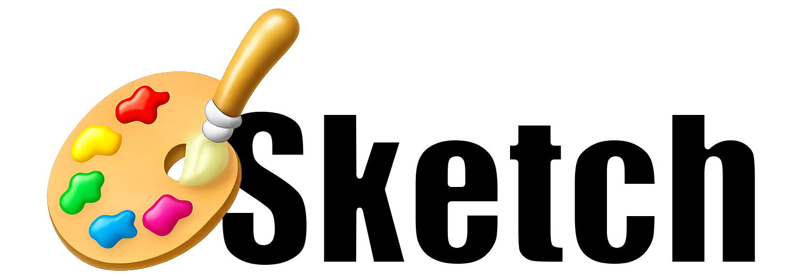

<div style="text-align: center; width: 100%">

</div>

## Sketch
[](https://travis-ci.org/daihase/Sketch)

[](http://cocoapods.org/pods/Sketch)
[](https://developer.apple.com/swift)
[](https://cocoapods.org/pods/Sketch)

Sketch has the basic functions for drawing from the beginning. Anyone can easily create drawing iOS Applications.

## :memo: Features
- Pen tool
- Eraser tool
- Stamp tool
- Undo / Redo
- Draw on Camera / Gallery image
- Multiple colors can be set
- Multiple width can be set
- Multiple alpha can be set
- Multiple tools (Line, Arrow, Rectangle, Ellipse)
- Multiple Pen Filters (Neon, Blur)

## :pencil2: Requirements
- Xcode 9.0+
- Swift 4.0+

## :pencil2: Installation

Sketch is available through [CocoaPods](http://cocoapods.org). To install
it, simply add the following line to your Podfile:

```ruby
pod 'Sketch'
```

## :pencil2: How to use
* with Stroryboard
  * **step1:** Set UIView on Storyboard.
  * **step2:** Open Inspector and enter `SketchView` in the Class field of Custom Class.
  * **step3:** Then just connect `SketchView` to UIViewController as usual.


* with Code

```Swift
// Create DrawView instance
let sketchView = SketchView(frame: CGRect(
  x: 0,
  y: 0,
  width: UIScreen.main.bounds.width,
  height: UIScreen.main.bounds.height)
)
// just set it to view
self.view.addSubview(sketchView)
```

:ok_hand: Most of the functions are implemented in the Example Application. Please see that for details.

## :pencil2: License

I am using Example Application icon from Freepik.  :point_right: [Designed by Freepik and distributed by Flaticon](https://www.freepik.com/)

Sketch is available under the MIT license. See the LICENSE file for more info.
